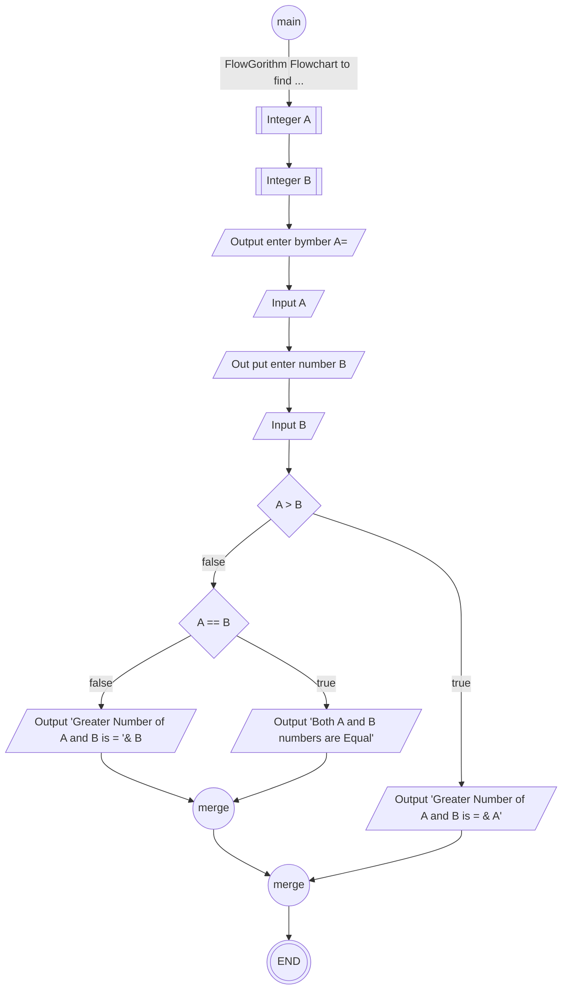

```mermaid
flowchart TD
    m((main)) -->
    |FlowGorithm Flowchart to find ...| A[[Integer A]]
    -->B[[Integer B]]
    -->bh1[/Output enter bymber A=/]
    -->bh2[/Input A/]
    -->bh3[/Out put enter number B/]
    -->bh4[/Input B/]
    -->condition1{A > B}
    condition1-->|false|condition2{A == B}
    condition1-->|true|bh5[/Output 'Greater Number of A and B is = & A'/]
    condition2-->|false|bh6[/Output 'Greater Number of A and B is = '& B/]
    condition2-->|true|bh7[/Output 'Both A and B numbers are Equal'/]
    bh6-->id1((merge))
    bh7-->id1((merge))
    id1-->id2(((End)))
    bh5-->id2((merge))
    id2-->id3(((END)))
```
   
