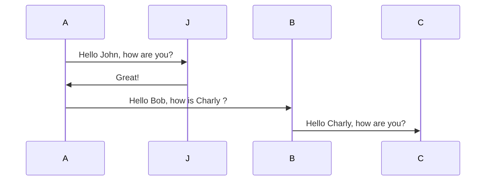

```mermaid
sequenceDiagram
    participant A
    participant J
    participant B
    participant C
    A->>J: Hello John, how are you?
    J->>A: Great!
    A->>B: Hello Bob, how is Charly ?
    B->>C: Hello Charly, how are you?
```

