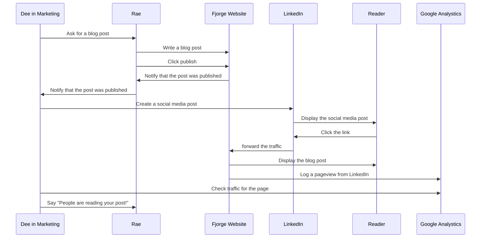

```mermaid
sequenceDiagram
    participant Dee in Marketing
    participant Rae
    participant Fjorge Website
    participant LinkedIn
    participant Reader
    participant Google Analystics
    Dee in Marketing->>Rae: Ask for a blog post
    Rae->>Fjorge Website: Write a blog post
    Rae->>Fjorge Website: Click publish
    Fjorge Website->>Rae: Notify that the post was published
    Rae ->>Dee in Marketing: Notify that the post was published
    Dee in Marketing ->>LinkedIn: Create a social media post
    LinkedIn ->>Reader: Display the social media post
    Reader ->>LinkedIn: Click the link
    LinkedIn ->>Fjorge Website: forward the traffic
    Fjorge Website ->>Reader: Display the blog post
    Fjorge Website ->>Google Analystics: Log a pageview from LinkedIn
    Dee in Marketing ->>Google Analystics: Check traffic for the page
    Dee in Marketing ->>Rae: Say "People are reading your post!"
```

